# Anime Character Collection development documentation
## Introduction
The potential contexts that I choose is “Media Consumption”. With the development of the Internet and the digital age, media consumption is
taking up an increasingly large part of people's lives. Some of the common media
consumption I see include movies, TV series, anime, and digital music. The media
consumption that accounts for the highest percentage of my life is anime, so I havenarrowed down the media consumption to anime related content. As I watch anime, I come across some characters I really like, such as "Eiri" from"Saekano: How to Raise a Boring Girlfriend". However, as I watch more and moreanime, I sometimes have trouble remembering some of my favorite anime
characters. So, I would like to further narrow down the content of anime relatedcontent to the content of anime characters. Therefore, I want to make a tracking application "anime character collection", whichusers can use to record and collect their favorite anime characters fromthe animethey have seen. This tracking application can provide useful historical information, allowing anime fans to record their love. It also allows anime fans to create their
own unique anime character collection Gallery. At this time, more and more young people are watching anime, so I believe this
tracking application will be useful.

# Version1 

Based on feedback from the Web App Design assignment, "It may be hard to get the user to upload an image as this is above your skill level", I plan to put the "upload image" feature aside for now. I'm not going to achieve the uploading image function first.

So I start with achieve other functions like add anime characters with their names, hair color, eye color and so on.

Because now I want to test whether I can successfully add the detailed information of an anime character, so I first default all data models to text field as a test.

When I entered text into the form to add anime characters as a test, I saw it succeed.

In the next step, I will make the form pop-up and change some text fields to drop-down.

# Version2

## Version2.1
Now I have changed the css to change the add anime character form to the popup page, users can use this pop up form top add new character.

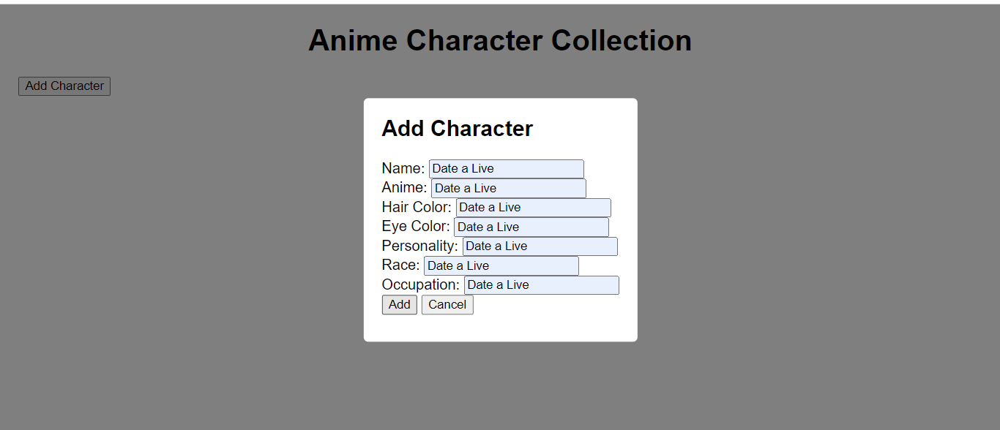

What I have to do now is to improve the data type of the add anime character form to what I wrote in the Data Model, and change some text fields to drop-down options.
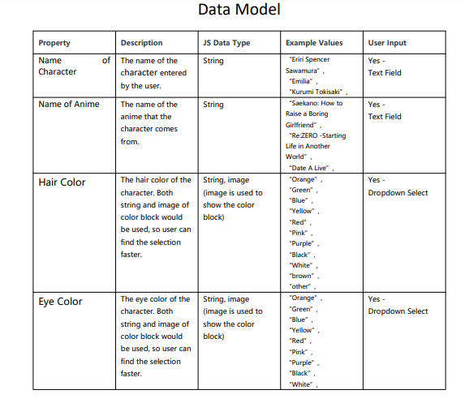
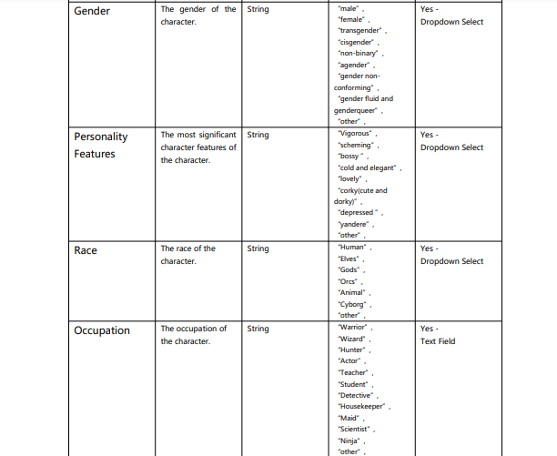

Based on the feedback from the Web App Design assignment, "It might be worth changing up the user input type to make it more interactive, e.g. showing the eye and hair colour in a checkbox or radio input." I decide to use the checkbox for the property of "Personality
Features", and still use the dropdown select for the "hair color" amd "eye color". 

There are mainly two reasons for setting such User Input. The first one is, even if some anime characters have multiple hair and eye colors, usually they have one main color that impress people. The second reason is that, if I change the User Input method of Hair Color and Eye Color from dropdown to chechbox, the add new character popup form would be too long. This is because there are many kinds of Hair and Eye Colors, which would make the add new character popup form looks too long and in a mess. So, I decide to use the dropdown select for the "hair color" and "eye color", and use the checkbox for the property of "Personality
Features".

The User Input method of other properties is basically the same as the previous Data Model, but I also got feedback from the tutor, saying that some dropdown select options are too many, and some simplifications can be made, such as some options can be replaced by "other".

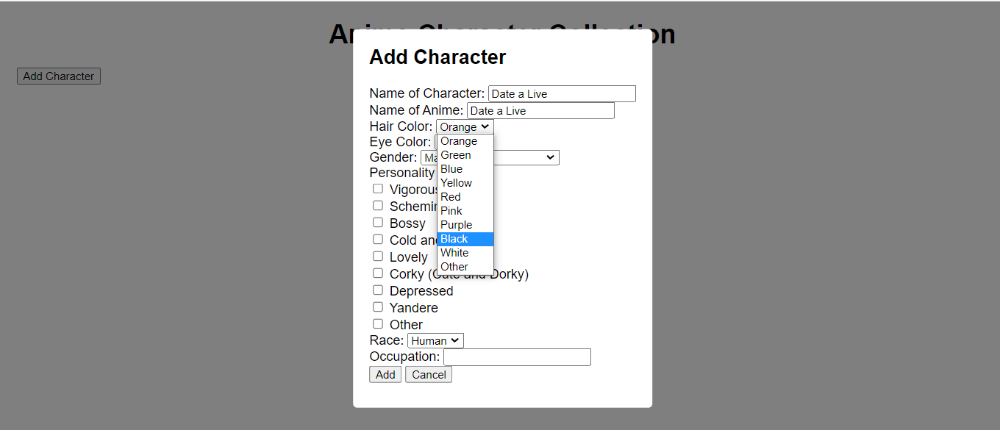

## Version2.2
I had realized that I forgot to add the ID and Date properties to the new added anime character, so I have added the ID and Date properties to make it complete.

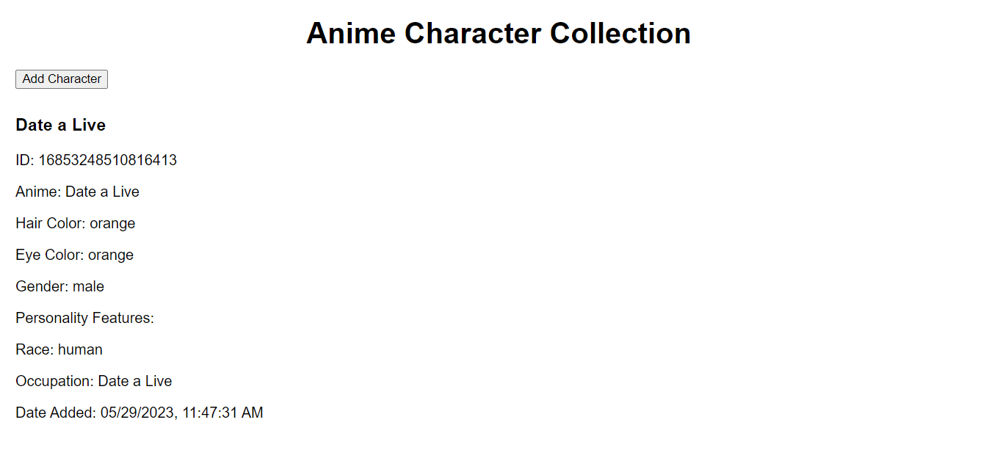
I feel that the ID and Date properties are too conspicuous, and I want to make them smaller.
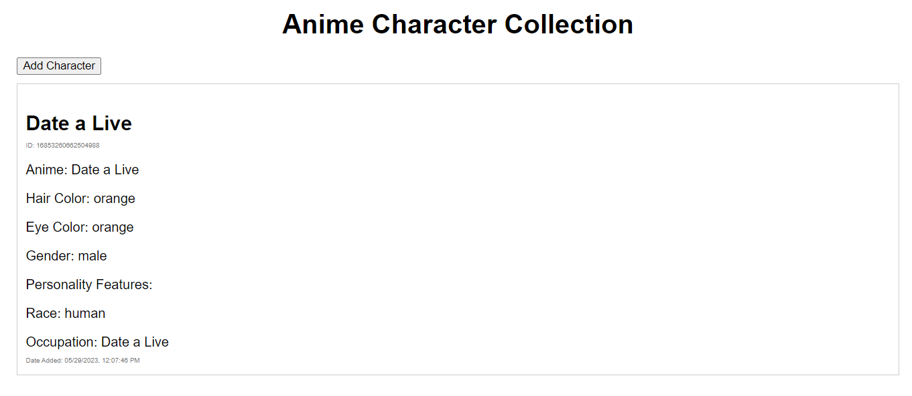

# Version3

Now I had completed the basic functions of adding new anime characters, the next step is to make the layout looks more beautiful.

This is the mockup that I designed in the Web App Design assignmenmt, but because I'm not going to achieve the function of upload images of character, the layout would be different.

When users add more anime characters to the website, the display on home page would look like this so far.
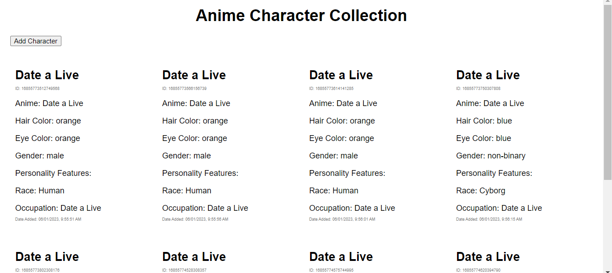
The next step is to make the display on the home page looks more beautiful, and change the add new character button to the side.

# Version4
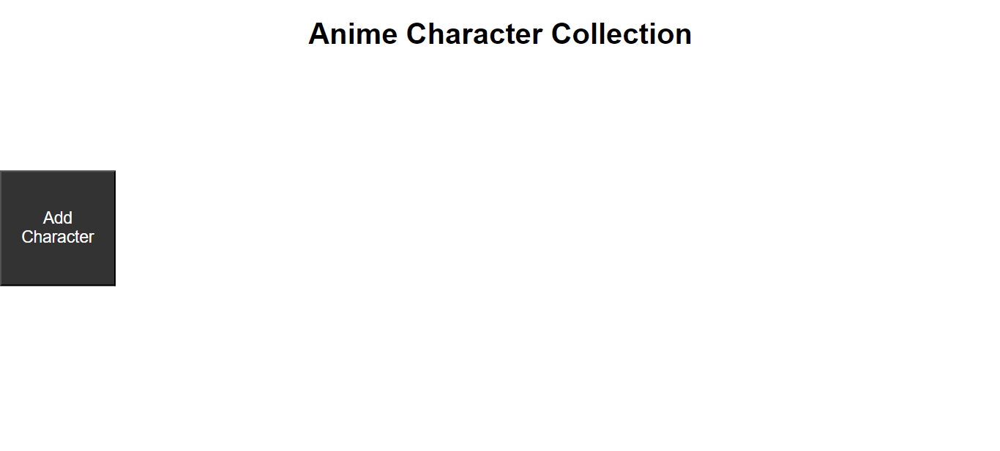
I had moved the button to the left side, but I realised that if I'm not going to  achieve some functions of the navigation bar, why can't I move the button of add character to the navigation bar?
# Version5
Because I don't intend to achieve the previously designed function that users can upload their own avatars on the right side of the navigation bar, so the space on the right side of the navigation bar is vacant, which is just used to place the Add Character button.
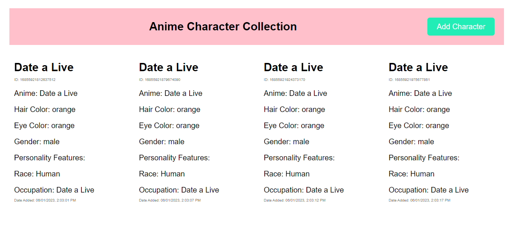
The next step is to add the LOGO to the left side of the navigatin bar, but I meet some problmes to display the LOGO on the home page.

When I run the code on the server by "http://localhost:8888/", the LOGO always can't be displayed on the website. At first I thought there is something wrong with the file path, and I tried many times to change the file path but it still didn't work.
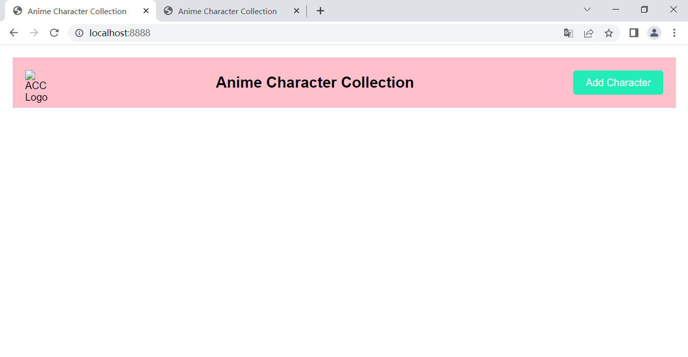

Then I tried to run the code on my local file, and the result is the LOGO displayed successfully. I guess it might be something wrong with the server.
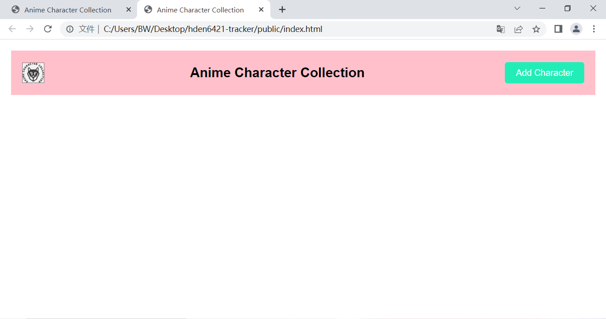

I tried to recall the things that I have done at the begining of this assignment. I remembered that I have set the server at the very begining, so I took a look at the server.js. Then I found out that  "app.use(express.static('public'));". I guess it might be because that I have only set the "public" folder to the server, and the server can't find the "image" or "logo.png" file. So I moved the image folder to the inside of public folder, and change the file path to "./image/logo.png". And it finally works!
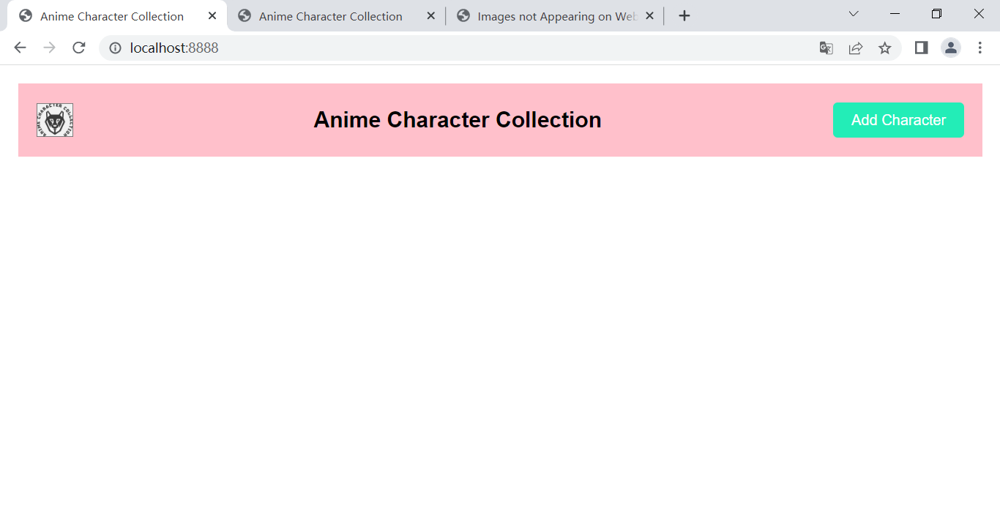
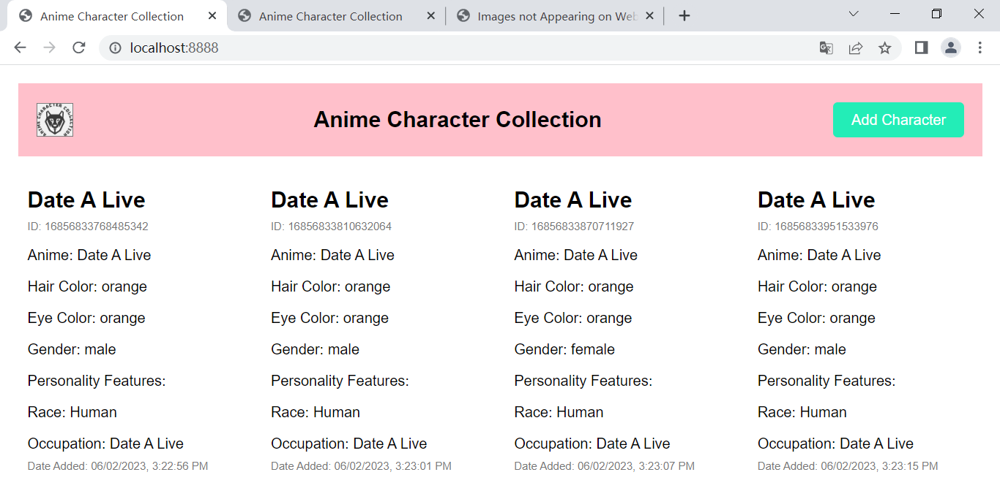