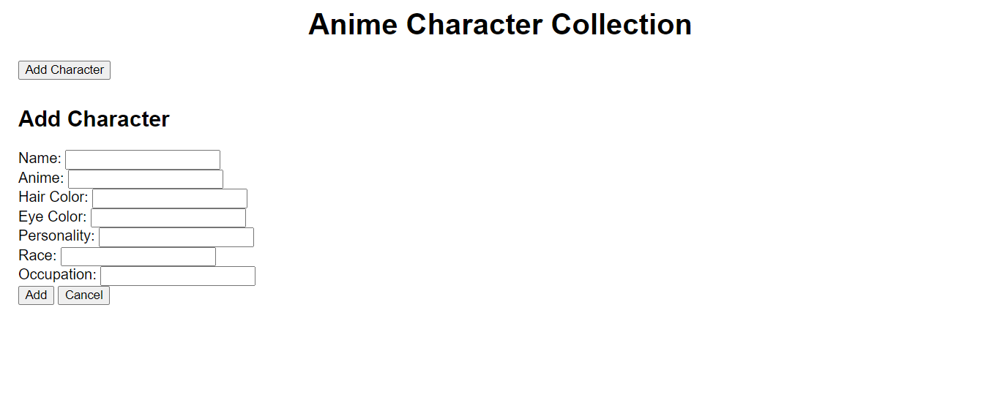
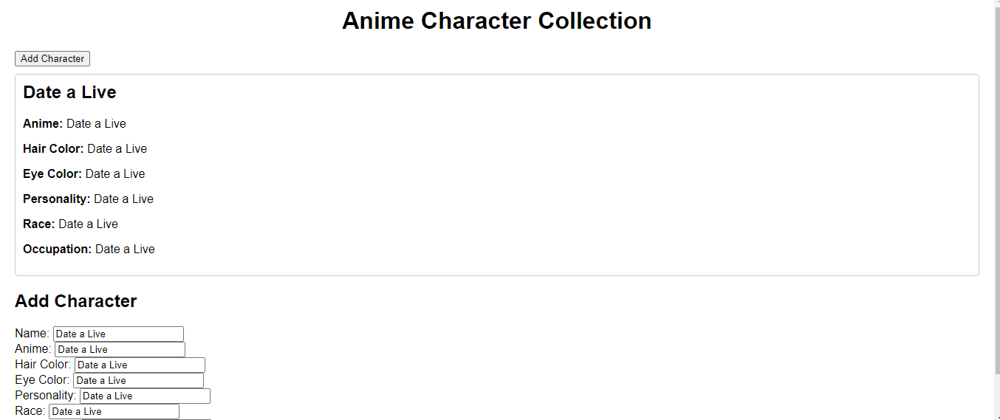

# Anime Character Collection development documentation

# Version1 

Based on feedback from the Web Design assignment, "____", I plan to put the "upload image" feature aside for now. I'm not going to achieve the uploading image function first.

So I start with achieve other functions like add anime characters with their names, hair color, eye color and so on.

Because now I want to test whether I can successfully add the detailed information of an anime character, so I first default all data models to text field as a test.

When I entered text into the form to add anime characters as a test, I saw it succeed.

In the next step, I will make the form pop-up and change some text fields to drop-down.

# Version2

Now I have changed the add character form to the popup page, users can use this pop up form top add new character.